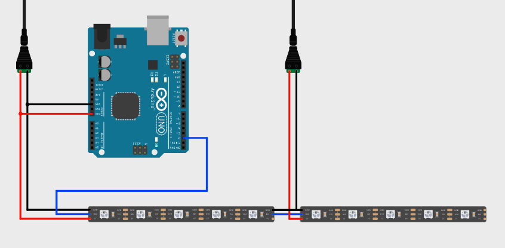
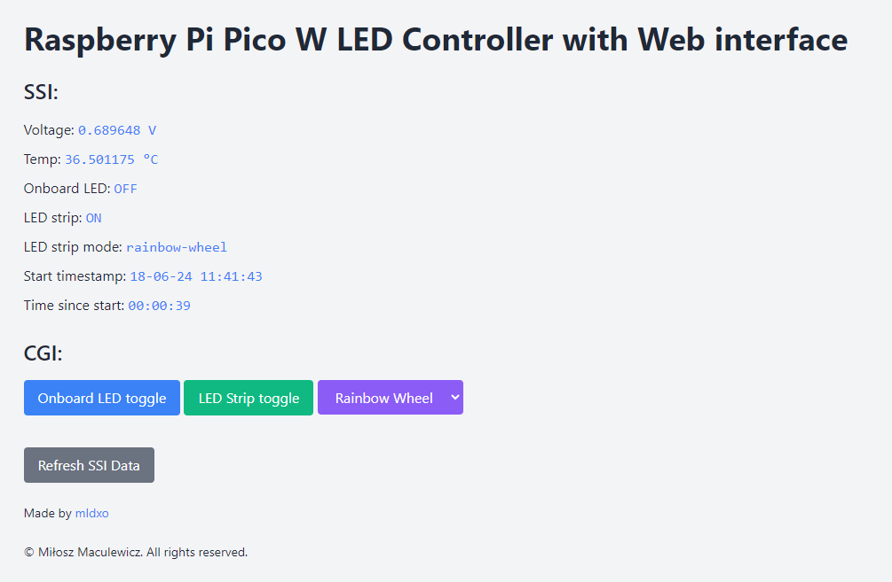

# Raspberry Pi Pico W LED Controller with Web interface

[](https://github.com/mldxo/pico-led-controller/actions/workflows/cmake.yml)
[](https://github.com/mldxo/pico-led-controller/actions/workflows/codeql.yml)

This project is a simple example of how to manage a WS2812B LED strip with a Raspberry Pi Pico W and a Web interface.

## Features

- [x] WS2812B LED strip controller
- [x] IRQ based light state buttons handling
- [x] Wi-Fi connection
- [x] Web interface light state control
- [x] NTP time synchronization

## Documentation

Documentation is available [here](https://mldxo.github.io/pico-led-controller/docs).

## Hardware

- Raspberry Pi Pico W
- WS2812B LED strip
- 5V power supply/supplies

For 120 LEDs to power, you will need a 5V power supply with at least 6A current. The power supply should be connected to the LED strip and the Raspberry Pi Pico W. For this project, two 5V 3A power supplies were used. General schema is shown below:



## Software

The code is written in C and follows `src, include` structure. The project is based on the Raspberry Pi Pico SDK and FreeRTOS.

### Build

For this project to build, you will need the following packages:

```bash
sudo apt-get update
sudo apt-get install -y cmake gcc-arm-none-eabi libnewlib-arm-none-eabi build-essential
```

You will probably need those environmental variables exported:

```bash
export PICO_SDK_FETCH_FROM_GIT="ON"
export PICO_EXTRAS_FETCH_FROM_GIT="ON"
export PICO_SDK_FETCH_FROM_GIT_PATH="./pico-sdk"
export PICO_EXTRAS_FETCH_FROM_GIT_PATH="./pico-extras"
```

There is gitignored Wi-Fi credentials file to create in following directory `led_controller/wifi_credentials.h`:

```c
#ifndef _WIFI_CREDENTIALS_H
#define _WIFI_CREDENTIALS_H

#define WIFI_SSID "wifi_ssid"
#define WIFI_PASSWORD "wifi_password"

#endif
```

## Web interface

The web interface is a simple page that allows you to control the LED strip. It is served by the Raspberry Pi Pico W itself. Data fetch intervals are set to 5 seconds to avoid overloading the Pico W. Start timestamp is created by the server although counting elapsed is fully client-sided.



### Build

To build the web interface, simply run:

```bash
python3 makefsdata.py
```

### Install

If you will be using the web interface locally, you don't need https to install the app. In Chrome, resolve `chrome://flags/#unsafely-treat-insecure-origin-as-secure` and your's Pico W IP address. Restart the browser and [manifest.json](led_controller/src/public/manifest.json) will allow for the install.

## Usage

After building the project, you can flash the Raspberry Pi Pico W with the generated `led_controller.uf2` file. The LED strip should light up with the default mode `Rainbow Wheel`. You can change the color by choosing one of the buttons on the web interface. When connecting to the Wi-Fi for the first time, check the serial output for the IP address.

## License

This project is licensed under the MIT License - see the [LICENSE](LICENSE) file for details.

## References

- [pico-sdk](https://github.com/raspberrypi/pico-sdk)
- [pico-examples](https://github.com/raspberrypi/pico-examples)
- [makefsdata.py](https://github.com/krzmaz/pico-w-webserver-example/pull/1/files/4b3e78351dd236f213da9bebbb20df690d470476#diff-e675c4a367e382db6f9ba61833a58c62029d8c71c3156a9f238b612b69de279d)
