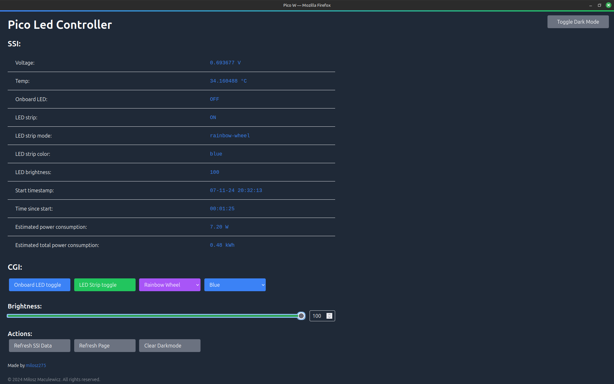

# Pico LED Controller

[](https://github.com/milosz275/pico-led-controller/actions/workflows/cmake.yml)
[](https://github.com/milosz275/pico-led-controller/actions/workflows/codeql.yml)
[](https://github.com/milosz275/pico-led-controller/actions/workflows/doxygen-pages.yml)


Raspberry Pi Pico W LED Controller is a simple example of how to manage a WS2812B LED strip using state buttons and a web interface. The project is based on the Raspberry Pi Pico SDK. The web interface is served by the Raspberry Pi Pico W itself.

- [GitHub repository](https://github.com/milosz275/pico-led-controller)
- [Doxygen documentation](https://milosz275.github.io/pico-led-controller/)

## Table of contents

- [Features](#features)
- [Hardware](#hardware)
- [Software](#software)
  - [Build](#build)
- [Web interface](#web-interface)
  - [Compile](#compile)
  - [Install](#install)
- [Usage](#usage)
- [License](#license)
- [References](#references)

## Features

- [x] WS2812B LED strip controller
- [x] IRQ based light state buttons handling
- [x] Wi-Fi connection
- [x] Web interface light state control
- [x] NTP time synchronization

### Modes

- [x] Rainbow Wheel
- [x] Rainbow Cycle
- [x] Static Color
- [x] Breathing
- [x] Flashing
- [ ] Wave
- [ ] Fade

### Colors

- [x] Red
- [x] Green
- [x] Blue
- [x] Cyan
- [x] Yellow
- [x] Pink
- [x] Magenta
- [x] Purple
- [x] Orange
- [x] Turquoise
- [x] White

## Hardware

- Raspberry Pi Pico W
- WS2812B LED strip
- 5V power supply/supplies

For 120 LEDs to power, you will need a 5V power supply with at least 6A current. The power supply should be connected to the LED strip and the Raspberry Pi Pico W. For this project, two 5V 3A power supplies were used. General schema is shown below:


## Software

The code is written in C and follows `src, include` structure. The project is based on the Raspberry Pi Pico SDK and FreeRTOS.

### Build

This project connect `pico-sdk` and `pico-extras` as submodules into the `lib` directory.

For the project to build, you will need the following packages:

```bash
sudo apt-get update
sudo apt-get install -y cmake gcc-arm-none-eabi libnewlib-arm-none-eabi build-essential
```

There is gitignored Wi-Fi credentials file to create in following directory `led_controller/include/wifi_credentials.h`:

```c
#ifndef _WIFI_CREDENTIALS_H
#define _WIFI_CREDENTIALS_H

#define WIFI_SSID "wifi_ssid"
#define WIFI_PASSWORD "wifi_password"

#endif
```

Initialize the submodules:

```bash
cd lib/pico-sdk
git submodule update --init
```

To build the project, run:

```bash
mkdir build
cd build
cmake ..
make
```

Built `LedController.uf2` file can be found in the `build/led_controller` directory.

Before flashing the Raspberry Pi Pico W, connect the LED strip to the GPIO pin set in `led_controller/include/led_controller.h` and power it according to instructions in previous paragraphs. The LED strip should light up with the default mode `Rainbow Wheel`.

## Web interface

The web interface is a simple page that allows you to control the LED strip. It is served by the Raspberry Pi Pico W itself. Data fetch intervals are set to 5 seconds to avoid overloading the Pico W. Start timestamp is created by the server although counting elapsed is fully client-sided.



### Compile

> [!NOTE]
> Building the frontend separately with Python is an older practice. This could be avoided using CMAKE.
>

To build the web interface, simply run:

```bash
python3 makefsdata.py
```

### Install

If you will be using the web interface locally, you don't need https to install the app. In Chrome, resolve `chrome://flags/#unsafely-treat-insecure-origin-as-secure` and your's Pico W IP address. Restart the browser and [manifest.json](https://github.com/milosz275/pico-led-controller/blob/main/led_controller/public/manifest.json) will allow for the install. Then, Chrome flag can be set back to default.

## Usage

After building the project, you can flash the Raspberry Pi Pico W with the generated `led_controller.uf2` file obtained from `build/led_controller/src` directory. The LED strip should light up with the default mode `Rainbow Wheel`. You can change the color by choosing one of the buttons on the web interface. When connecting to the Wi-Fi for the first time, check the serial output for the IP address.

## License

This project is licensed under the MIT License - see the [LICENSE](https://github.com/milosz275/pico-led-controller/blob/main/LICENSE) file for details.

## References

- [pico-sdk](https://github.com/raspberrypi/pico-sdk)
- [pico-examples](https://github.com/raspberrypi/pico-examples)
- [makefsdata.py](https://github.com/krzmaz/pico-w-webserver-example/pull/1/files/4b3e78351dd236f213da9bebbb20df690d470476#diff-e675c4a367e382db6f9ba61833a58c62029d8c71c3156a9f238b612b69de279d)
- [powering ws2812b](https://www.temposlighting.com/guides/power-any-ws2812b-setup)
